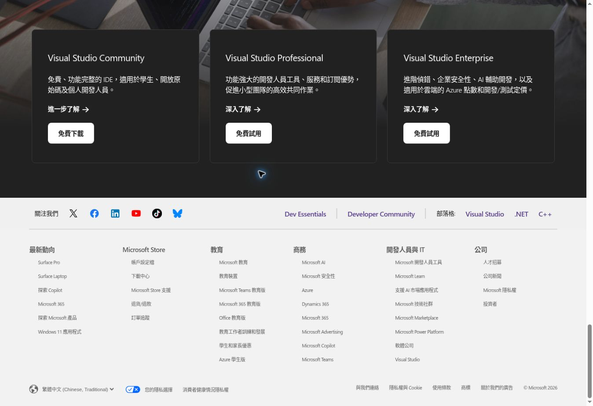
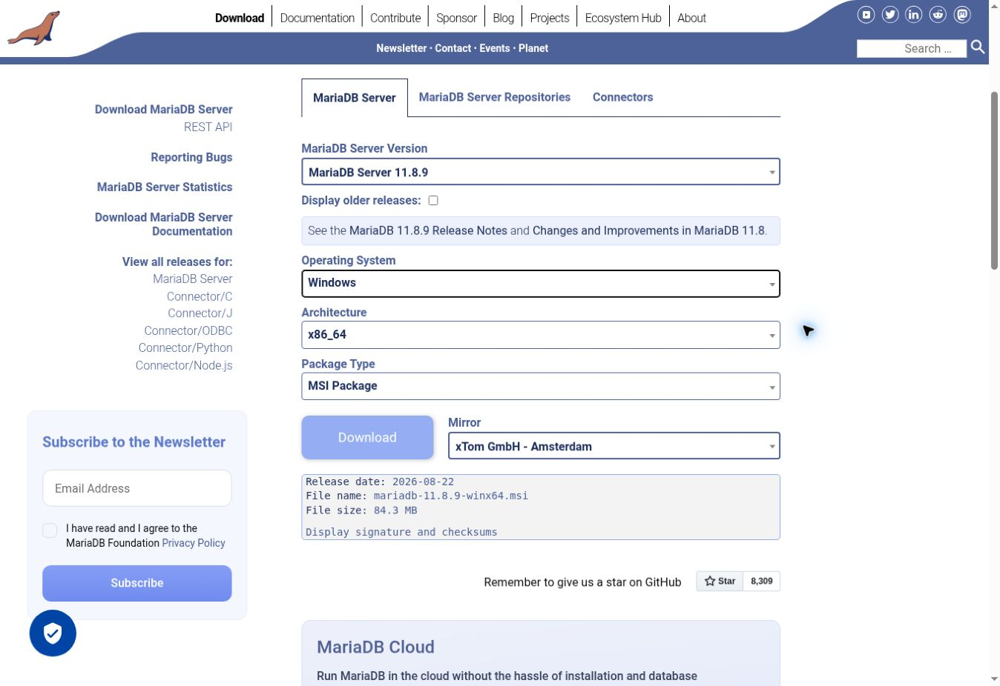
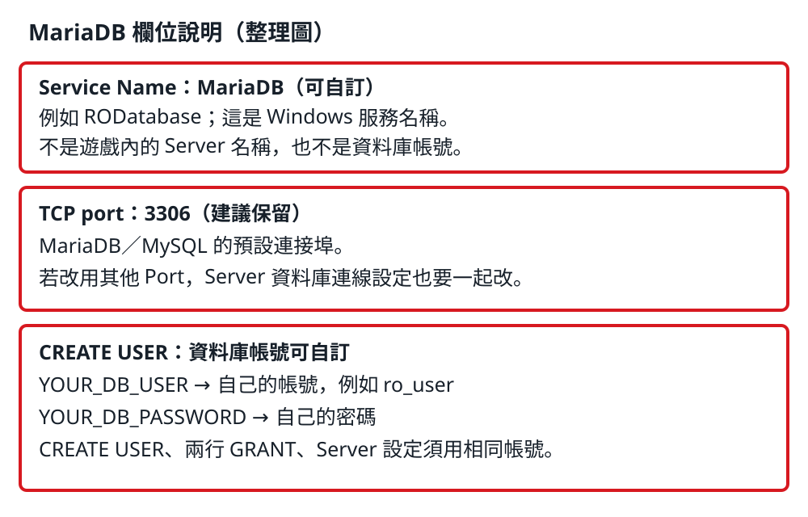
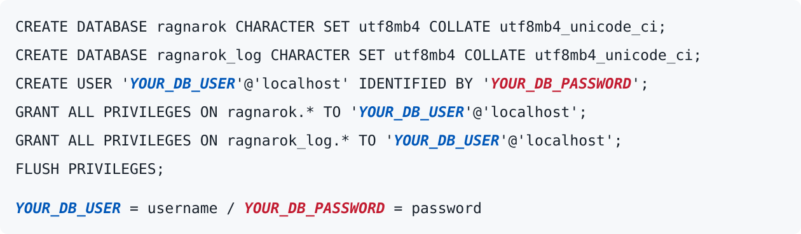

# 02 建立 Server

繁體中文 | [English](en/02-server.md)

依序完成下面步驟。本章以 **Client 與 Server 在同一台 Windows 電腦上測試** 為前提；資料庫指令用於全新、空白資料庫。

## 1. 安裝 Git

下載：[Git for Windows](https://gitforwindows.org/)

點 **Download**，下載 Windows 安裝程式並完成安裝。後面的原始碼下載會使用 Git Bash。

## 2. 安裝編譯工具

下載：[Visual Studio Community](https://visualstudio.microsoft.com/zh-hant/vs/community/)

1. 在網頁找到 **Visual Studio Community**，點這一欄的 **「免費下載」**。
2. 執行下載的安裝程式。
3. 開啟 Visual Studio Installer 的「工作負載」畫面。
4. 勾選 **使用 C++ 的桌面開發**，保留該工作負載預設勾選的 MSVC 編譯工具與 Windows SDK。
5. 點「安裝」，等待完成。

下載頁參考截圖：選左側 **Community → 免費下載**。



完成確認：能開啟 Visual Studio。

參考畫面（Microsoft 官方文件，版本不同時外觀可能略有差異）：


[查看官方圖文說明](https://learn.microsoft.com/zh-tw/cpp/build/vscpp-step-0-installation)

## 3. 準備 rAthena

原始碼：[rAthena GitHub](https://github.com/rathena/rathena)

建立 `C:\RO-Server` 資料夾，在資料夾空白處按右鍵 → 顯示其他選項 → Open Git Bash here，輸入：

```bash
cd /c/RO-Server
git clone https://github.com/rathena/rathena.git
```

下載完成後，原始碼位於：

```text
C:\RO-Server\rathena
```

要重現原本成功的版本，使用已保存的原始碼；上面的指令會下載當前版本。

完成確認：資料夾內能找到 `rAthena.sln`。下載後，在 Git Bash 輸入以下指令並記下輸出的版本編號，之後才能重現相同原始碼：

```bash
cd /c/RO-Server/rathena
git rev-parse HEAD
```

[Windows 安裝參考手冊](https://github.com/rathena/rathena/wiki/Install-on-Windows)

## 4. 編譯 Server

開啟：

```text
C:\RO-Server\rathena\rAthena.sln
```

**編譯前先核對 PACKETVER**：目前 Client 為 `2021-11-03_Ragexe_patched.exe`，日期值是 `20211103`。檢查 `src/config/packets.hpp` 及 `src/custom/defines_pre.hpp` 是否有不同的 `PACKETVER` 定義；自訂定義可能覆蓋預設值。你原本 Server 的最終設定仍待核對，請參考 [01 確認版本](01-versions.md)。若修改封包版本，必須重新建置才能生效。

[設定參考：rAthena packets.hpp](https://github.com/rathena/rathena/blob/master/src/config/packets.hpp)

先選擇 **Release → x64**，再用以下任一方式建置：

- 選單：上方「建置（B）」→「建置方案」。
- 快捷鍵：**Ctrl + Shift + B**（同時按下，Visual Studio 預設按鍵）。

[快捷鍵參考：Microsoft 官方文件](https://learn.microsoft.com/zh-tw/visualstudio/ide/default-keyboard-shortcuts-in-visual-studio)

完成後，查看 Visual Studio 下方的「輸出」視窗。

你當時成功的建置結果是：

```text
15 成功，0 失敗
```

確認 **失敗為 0**，並在 `C:\RO-Server\rathena` 找到以下三個檔案。若使用不同版本的 rAthena，成功專案數可能不同：

```text
login-server.exe
char-server.exe
map-server.exe
```

## 5. 安裝資料庫

下載：[MariaDB Server](https://mariadb.org/download/)

已使用版本：**11.8.9**。在下載頁依序選擇：

1. MariaDB Server Version：**11.8.9**。
2. Operating System：**Windows**。
3. Architecture：**x86_64**。
4. Package Type：**MSI Package**。
5. 點 **Download**，下載完成後執行 `mariadb-11.8.9-winx64.msi`。

下載頁參考截圖：



安裝時設定：

- **Service Name（Windows 服務名稱）**：可以自訂，例如 `MariaDB` 或 `RODatabase`。這是 Windows「服務」中的名稱，不是遊戲內的 Server 名稱，也不是資料庫帳號。
- **TCP port：3306**：MariaDB／MySQL 慣用的預設連接埠，保持預設能讓後面的連線設定一致。可以改，但步驟 8 的所有資料庫 Port 都要一起改；若 3306 已被其他資料庫占用，可另選未使用的 Port。
- 設定自己的 root 密碼
- 勾選 Install as service、Enable networking

完成確認：開始選單可找到 MariaDB Client。

參考畫面（MariaDB 官方文件）：

**設定 root 密碼的畫面**


**設定服務名稱與 Port 的畫面**


圖片只供辨認欄位（圖中為 MariaDB 10.6）；服務名稱可自訂，TCP port 建議維持 **3306**，密碼用自己的。

**紅框欄位說明（整理圖，非安裝程式截圖）：**



[查看官方圖文說明](https://mariadb.com/docs/server/server-management/install-and-upgrade-mariadb/installing-mariadb/binary-packages/installing-mariadb-msi-packages-on-windows)

## 6. 建立資料庫

開啟 **MySQL Client (MariaDB)**，輸入安裝時設定的 root 密碼。這個管理員密碼與下面供 rAthena 使用的資料庫密碼是兩個不同用途的密碼。

先輸入以下指令核對實際版本與 Port；若 Port 不是 3306，步驟 8 要使用這裡顯示的值：

```sql
SELECT VERSION(), @@port;
```

**資料庫帳號也可以自訂**。下面的 `YOUR_DB_USER`、`YOUR_DB_PASSWORD` 都是占位文字，執行前要換成自己的帳號和密碼（例如帳號 `ro_user`）。三行中的帳號必須相同。

這是供 rAthena 連線的資料庫帳號，不是遊戲登入帳號；`localhost` 表示限本機使用。資料庫名稱這份手冊維持 `ragnarok`、`ragnarok_log`。

**欄位標示：藍色粗斜體為帳號；紅色粗斜體為密碼。** 以下是顏色說明圖，下方 SQL 區塊可直接複製，執行前請替換占位文字。



```sql
CREATE DATABASE ragnarok CHARACTER SET utf8mb4 COLLATE utf8mb4_unicode_ci;
CREATE DATABASE ragnarok_log CHARACTER SET utf8mb4 COLLATE utf8mb4_unicode_ci;
CREATE USER 'YOUR_DB_USER'@'localhost' IDENTIFIED BY 'YOUR_DB_PASSWORD';
GRANT ALL PRIVILEGES ON ragnarok.* TO 'YOUR_DB_USER'@'localhost';
GRANT ALL PRIVILEGES ON ragnarok_log.* TO 'YOUR_DB_USER'@'localhost';
FLUSH PRIVILEGES;
```

完成確認：每行執行後沒有 `ERROR`。若提示資料庫或帳號已存在，先確認是否已做過這一步，不要刪除既有資料重新建立。

## 7. 匯入資料表

在同一個 MariaDB Client 視窗依序執行（保持 root 登入）。`SOURCE` 後面是 **你的實際原始碼路徑**；若資料夾不同，要一起更改。SQL 檔請使用與編譯 Server 相同版本原始碼內的檔案：

```sql
USE ragnarok;
SOURCE C:/RO-Server/rathena/sql-files/main.sql;
SHOW TABLES;
USE ragnarok_log;
SOURCE C:/RO-Server/rathena/sql-files/logs.sql;
SHOW TABLES;
```

完成確認：`ragnarok` 中能看到 `login`、`char` 等資料表；`ragnarok_log` 中能看到 `loginlog`，且匯入過程沒有 `ERROR`。如果顯示無法開啟檔案，先檢查 `SOURCE` 路徑。

## 8. 設定資料庫連線

開啟：

```text
C:\RO-Server\rathena\conf\inter_athena.conf
```

修改檔案中以下 **6 組連線欄位**，包括容易漏掉的 `ipban_db`：

| IP 欄位 | Port 欄位 | 帳號欄位 | 密碼欄位 | 資料庫欄位 | 資料庫名稱 |
| --- | --- | --- | --- | --- | --- |
| `login_server_ip` | `login_server_port` | `login_server_id` | `login_server_pw` | `login_server_db` | `ragnarok` |
| `ipban_db_ip` | `ipban_db_port` | `ipban_db_id` | `ipban_db_pw` | `ipban_db_db` | `ragnarok` |
| `char_server_ip` | `char_server_port` | `char_server_id` | `char_server_pw` | `char_server_db` | `ragnarok` |
| `map_server_ip` | `map_server_port` | `map_server_id` | `map_server_pw` | `map_server_db` | `ragnarok` |
| `web_server_ip` | `web_server_port` | `web_server_id` | `web_server_pw` | `web_server_db` | `ragnarok` |
| `log_db_ip` | `log_db_port` | `log_db_id` | `log_db_pw` | `log_db_db` | `ragnarok_log` |

每一組的 IP 都填 `127.0.0.1`，Port 都填步驟 5 的值（預設 `3306`），帳號與密碼都填步驟 6 自訂的值。只有資料庫名稱依表格分別填入。另保持 `log_login_db: loginlog`。

**檢查覆蓋設定**：`inter_athena.conf` 最後會載入 `conf/import/inter_conf.txt`。若該檔已有相同欄位，請在該檔修改，避免主設定被覆蓋；全新設定也可將自訂欄位放在這個 import 檔中。儲存後重新啟動 Server。

[欄位名稱參考：rAthena inter_athena.conf](https://github.com/rathena/rathena/blob/master/conf/inter_athena.conf)

資料庫帳號與 Server 之間的連線帳號是不同的：`char_athena.conf`、`map_athena.conf` 的 `userid`／`passwd` 對應 `ragnarok.login` 中 `sex = 'S'` 的 Server 帳號，**不要直接填成步驟 6 的資料庫帳號**。本章僅本機測試；日後開放外部連線前，須更換預設 Server 連線帳密，並同步修改對應設定及資料列。

儲存檔案。

## 9. 啟動 Server

依序開啟：

```text
login-server.exe
char-server.exe
map-server.exe
```

看到以下結果代表啟動成功：

- Login：ready，Port 6900
- Char：ready，Port 6121
- Map：online，Port 5121
- 沒有資料庫連線錯誤

**完成確認：三個 Server 保持執行，沒有資料庫或 Server 間連線錯誤。** 這代表本章的啟動檢查通過；能否登入遊戲，還需要完成下一章 Client 設定。

[下一步：建立 RO Client](03-client.md)


## 來源與用途說明

安裝畫面來源：上方已標示的 Microsoft、MariaDB 官方網站與文件；紅框欄位整理圖為本手冊製作。

本倉庫整理個人的安裝紀錄，供學習與技術交流參考，並非官方文件，亦不代表與相關權利人有合作或授權關係。文中提及的軟體、商標及第三方圖片，其權利屬各權利人；使用、修改或散布時，仍須遵守原始授權及適用法律。標註來源或交流用途，不等於取得授權。


## 教學內容授權

本倉庫中由作者享有著作權的原創教學文字及自製圖解，採 [CC BY-NC-SA 4.0](https://creativecommons.org/licenses/by-nc-sa/4.0/deed.zh-hant) 授權。

歡迎非商業用途的分享與修改，請標示作者 **rayjhih8263**、[原始倉庫](https://github.com/rayjhih8263/RO-Private-Server)及授權連結，並註明修改內容；修改後公開分享時，須使用相同授權。未經權利人另行許可，不得將上述內容用於商業目的，包括打包販售、付費下載，或收錄於付費教材。

第三方軟體、遊戲素材、商標、截圖及圖片不屬於本授權範圍，仍依各權利人的授權規定使用。標註來源或交流用途，不等於取得授權。

[完整授權說明](../LICENSE.md)
