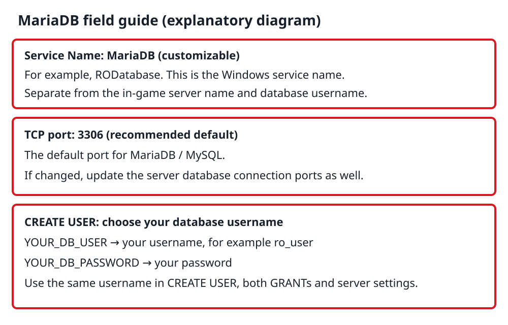

# 02 Set up the server

[繁體中文](../02-server.md) | English

Follow the steps in order. The database commands below are intended for a fresh, empty database.

## 1. Install Git

Download: [Git for Windows](https://gitforwindows.org/).

Click **Download**, download the Windows installer and complete installation. Git Bash will be used to download the source code.

## 2. Install the build tools

Download: [Visual Studio Community](https://visualstudio.microsoft.com/vs/community/).

1. Find **Visual Studio Community** and click **Free download** in that column.
2. Run the downloaded installer.
3. Open the **Workloads** screen in Visual Studio Installer.
4. Select **Desktop development with C++**.
5. Click **Install** and wait for completion.

Download-page reference: choose **Community → Free download** on the left. The saved screenshot shows the Traditional Chinese interface.


Completion check: Visual Studio opens.

Workload reference from Microsoft documentation; the appearance may differ between versions:


[Microsoft installation instructions](https://learn.microsoft.com/en-us/cpp/build/vscpp-step-0-installation)

## 3. Prepare rAthena

Source: [rAthena on GitHub](https://github.com/rathena/rathena).

Create `C:\RO-Server`. Right-click an empty area in that folder → **Show more options** → **Open Git Bash here**, then enter:

```bash
cd /c/RO-Server
git clone https://github.com/rathena/rathena.git
```

The source will be in:

```text
C:\RO-Server\rathena
```

Use the previously saved source to reproduce the original successful version. The command above downloads the current version.

Completion check: `rAthena.sln` exists in the folder.

[rAthena Windows installation guide](https://github.com/rathena/rathena/wiki/Install-on-Windows)

## 4. Build the server

Open:

```text
C:\RO-Server\rathena\rAthena.sln
```

Select **Release → x64**, then build using either method:

- Menu: **Build → Build Solution**.
- Shortcut: **Ctrl + Shift + B** (Visual Studio's default keyboard mapping).

[Microsoft keyboard shortcut reference](https://learn.microsoft.com/en-us/visualstudio/ide/default-keyboard-shortcuts-in-visual-studio)

Check the **Output** window at the bottom. The owner's successful build reported:

```text
15 succeeded, 0 failed
```

Verify **0 failed** and that these three files were generated. The number of successful projects may differ with a different rAthena version:

```text
login-server.exe
char-server.exe
map-server.exe
```

## 5. Install the database

Download: [MariaDB Server](https://mariadb.org/download/).

Recorded version: **11.8.9**. Select:

1. MariaDB Server Version: **11.8.9**.
2. Operating System: **Windows**.
3. Architecture: **x86_64**.
4. Package Type: **MSI Package**.
5. Click **Download**, then run `mariadb-11.8.9-winx64.msi`.

Download-page reference:


During installation:

- **Service Name**: customizable, for example `MariaDB` or `RODatabase`. This identifies the service in Windows Services; it is separate from the in-game server name and database username.
- **TCP port: 3306**: the usual default port for MariaDB/MySQL. Keeping it makes the later connection settings consistent. If you change it, update all database ports in step 8 as well. If another database already uses 3306, choose an unused port.
- Set your own root password.
- Select **Install as service** and **Enable networking**.

Completion check: the MariaDB client appears in the Start menu.

Reference screens from MariaDB's official documentation:

**Root password**


**Service name and port**


These screenshots identify the fields and show MariaDB 10.6. Customize the service name, preferably keep port **3306**, and use your own password.

**Red-box field guide (an explanatory diagram, not an installer screenshot):**



[Official MariaDB Windows installer guide](https://mariadb.com/docs/server/server-management/install-and-upgrade-mariadb/installing-mariadb/binary-packages/installing-mariadb-msi-packages-on-windows)

## 6. Create the databases

Open **MySQL Client (MariaDB)** and enter the root password.

**The database username is customizable.** Replace `YOUR_DB_USER` and `YOUR_DB_PASSWORD` with your own username and password before running these commands (for example, username `ro_user`). Use the same username in all three relevant lines.

This account is for rAthena's database connection, separate from a game login account. `localhost` restricts it to local connections. This guide keeps database names `ragnarok` and `ragnarok_log`.


**Field colors: blue bold italic = username; red bold italic = password.** The image illustrates the fields. Copy the SQL block below and replace the placeholders before running it.


```sql
CREATE DATABASE ragnarok CHARACTER SET utf8mb4 COLLATE utf8mb4_unicode_ci;
CREATE DATABASE ragnarok_log CHARACTER SET utf8mb4 COLLATE utf8mb4_unicode_ci;
CREATE USER 'YOUR_DB_USER'@'localhost' IDENTIFIED BY 'YOUR_DB_PASSWORD';
GRANT ALL PRIVILEGES ON ragnarok.* TO 'YOUR_DB_USER'@'localhost';
GRANT ALL PRIVILEGES ON ragnarok_log.* TO 'YOUR_DB_USER'@'localhost';
FLUSH PRIVILEGES;
```

## 7. Import the tables

In the same window, run these commands in order:

```sql
USE ragnarok;
SOURCE C:/RO-Server/rathena/sql-files/main.sql;
SHOW TABLES;
USE ragnarok_log;
SOURCE C:/RO-Server/rathena/sql-files/logs.sql;
SHOW TABLES;
```

Completion check: tables are listed and no SQL errors appear.

## 8. Configure the database connection

Open:

```text
C:\RO-Server\rathena\conf\inter_athena.conf
```

Edit the existing database connection fields:

- Host: `127.0.0.1`
- Port: the TCP port set in step 5 (default `3306`)
- Database username: the actual username chosen in step 6
- Database password: the password chosen in step 6
- Login, Char, Map and Web database: `ragnarok`
- Log database: `ragnarok_log`
- `log_login_db`: `loginlog`

Save the file.

## 9. Start the server

Run in this order:

```text
login-server.exe
char-server.exe
map-server.exe
```

Successful startup indicators:

- Login: ready, port 6900
- Char: ready, port 6121
- Map: online, port 5121
- No database connection errors

**Completed: all three servers start successfully.**

[Next: Set up the RO client](03-client.md)

## Image sources

Installer images are from the Microsoft and MariaDB official sites and documentation linked above. The red-box field guide was created for this guide.

## License and use

Original teaching text and original diagrams, to the extent the author holds copyright in them, are licensed under [CC BY-NC-SA 4.0](https://creativecommons.org/licenses/by-nc-sa/4.0/).

You may share and adapt this material for noncommercial purposes. Credit **rayjhih8263**, link to this repository and the license, and indicate changes. Shared adaptations must use the same license. Commercial use, including selling bundles, paid downloads, or inclusion in paid teaching materials, requires separate permission from the rights holder.

Third-party software, game assets, trademarks, screenshots and images are excluded from this license and remain subject to their respective rights and licenses. This is an unofficial personal learning record. Attribution and an educational purpose do not replace permission. See [the license notice](../../LICENSE.md).
